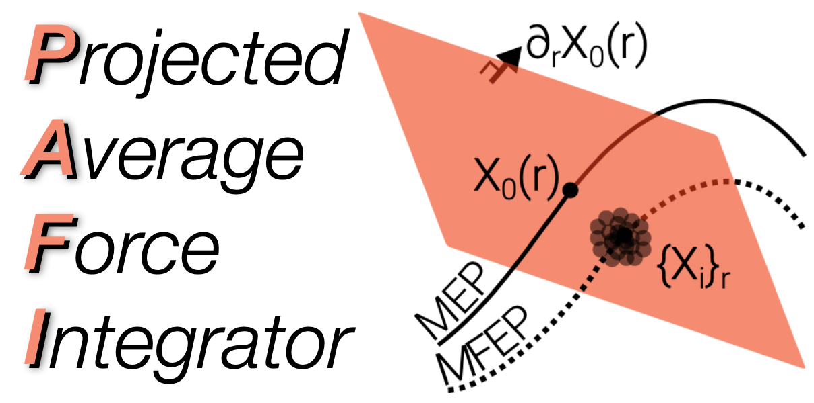

</img>
<h2> PAFI: Evaluation of free energy barriers beyond Harmonic TST</h2>
<h3 align='center'>
Python implementation (2024), (c) Swinburne & Marinica 2024<br><br>
<a href="https://github.com/tomswinburne/pafi/tree/cpp-2023">C++ implementation (2023) available here</a>
<h3 align="center">If using PAFI, please cite (<a href="#citation">bibtex</a>). Details in 
<a href="https://journals.aps.org/prl/abstract/10.1103/PhysRevLett.120.135503" target="_new">Swinburne & Marinica PRL 2018</a>.
</h3>
PAFI performs constrained sampling on <a href="https://docs.lammps.org/fix_neb.html" target="_new">NEB</a> hyperplanes in 
<a href="https://docs.lammps.org" target="_new">LAMMPS</a>, 
analytically reformulating an exact expression for the free energy gradient used in the
<a href="https://pubs.acs.org/doi/10.1021/jp506633n" target="_new">Adaptive Biasing Force</a> method.
This allows calculation of free energy barriers even when the minimum energy path (MEP)
is not aligned with the minimum free energy path (MFEP). PAFI thus performs
<a href="https://en.wikipedia.org/wiki/Stratified_sampling" target="_new">stratified sampling</a> of configuration 
space for a particular metastable pathway, with the usual reductions in variance.
</br>
<h3 align="center">
<a href="#quick-start">Quick Start</a>
| <a href="#full-installation">Full installation</a>
| <a href="#hints-and-tips">Hints and tips</a>
| <a href="#citation">Citation</a>
</h3>

## Quick Start
### Installation
- PAFI uses `mpi4py`, `numpy`, `scipy`,`pandas` and <a href="https://docs.lammps.org/Python_head.html" target="_new">LAMMPS-Python</a>
- You can try installing PAFI with `pip` (in an enviroment...) and run tests:
	```bash
  cd /path/to/this/repo
  python -m pip install -e . # local install
  python unittests.py -v
	```
- If this fails, see <a href="#full-installation">full installation</a> instructions

### Running Calculations
- Provide some initial pathway using e.g. <a href="http://lammps.sandia.gov/doc/neb.html" target="_new">LAMMPS NEB</a>. 

- New `equal` style gives optimal spacing for force integration- e.g. `fix neb all neb 1.0 parallel equal`

- Modify one of `examples/configuration_files/*_REAL.xml` to load in your pathway and potential

- Run with `mpirun`:
```bash
  mpirun -np ${NUM_PROCS} python simple_run.py
```
where `simple_run.py`:
```python
  from mpi4py import MPI
  from pafi import PAFIManager
  manager = PAFIManager(MPI.COMM_WORLD,"/path/to/config.xml")
  manager.run()
  manager.close()
  ```

- Alternatively, specify all custom options within python:
```python
  from mpi4py import MPI
  from pafi import PAFIManager, PAFIParser

  parameters = PAFIParser()
  parameters.set_pathway("systems/EAM-SIA-Fe/image_*.dat") # NEB pathway
  parameters.set_potential("systems/EAM-SIA-Fe/Fe.eam.fs","eam/fs",["Fe"]) # Potential
  
  # typical sampling values
  parameters.axes["Temperature"] = [100.*i for i in range(7)] # temperature range
  parameters.set("CoresPerWorker",1)
  parameters.set("SampleSteps",2000)
  parameters.set("ThermSteps",1000)
  parameters.set("ThermWindow",500)

  manager = PAFIManager(MPI.COMM_WORLD,parameters=parameters)
  manager.run()
  manager.close()
```

## Full installation
PAFI uses `mpi4py`, `numpy`, `scipy`, `pandas` and <b><a href="https://docs.lammps.org/Python_head.html" target="_new">LAMMPS-Python</a></b> with at least `MANYBODY` and `ML-SNAP`
If you have cmake and mpi installed:
```bash
export PREFIX=${HOME}/.local # example
export PYTHON=`which python` # to ensure same distribution
export MPICC=`which mpicc` # for mpi4py, your C++ MPI compiler (e.g. mpicc / mpiicc for intel)

# extract typical install location PLEASE CHECK THIS ON YOUR MACHINE!
# (see below for why this hack can be useful)
PYTHON_VERSION=`python --version | cut -f2 -d" " | cut -f2 -d"."`
export INSTALL_LOCATION=${PREFIX}/lib/python3.${PYTHON_VERSION}/site-packages

# get sources
git clone https://github.com/lammps/lammps.git
git clone https://github.com/tomswinburne/pafi.git

# install python packages
${PYTHON} -m pip install mpi4py numpy pandas

# LAMMPS build 
cd /path/to/lammps
mkdir build
cd build
cmake -C ../../pafi/lammps_options.cmake ../cmake
make -j

# LAMMPS python install: 
# whilst official command is 'make install python', can have env clashes
# instead, we do it "by hand":
cd ../python # within LAMMPS repository
${PYTHON} -m pip install -U .

# manually provide binary for LAMMPS package
cp ../build/liblammps.so ${INSTALL_LOCATION}/lammps

# Install and test PAFI
cd /path/to/pafi
pip install -e .
python unittests.py
```

## Hints and Tips

- See the [tutorial](TUTORIAL.md) for information on the `pafi-path-test` routine

- In general, we want a reference pathway with dense discretisation where energy gradients are large

- The current non-smoothed spline implementation can oscillate between very similar image configurations, as a result, there should be non-negligible displacement between images

- If your path isn't loading, try setting `LogLammps=1` in `config.xml` to check for bugs in `log.lammps`

- If `SampleSteps` is too large workers will make thermally activated "jumps" to nearby paths in the hyperplane. This will return a warning message `Reference path too unstable for sampling.`
 and increase error. If this happens, decrease `SampleSteps` and increase `nRepeats`

- When running on `NPROCS` cores, we require `NPROCS%CoresPerWorker==0`, so we have an integer number of workers

- The total number of force calls *per worker* is `nPlanes * (ThermSteps+SampleSteps) * nRepeats`, spatially parallelised by LAMMPS across `CoresPerWorker` cores for each worker.

- Each PAFI worker runs at the same speed as LAMMPS. Increasing `CoresPerWorker` will typically decrease execution time but also reduce `nWorkers` and increase error, as we have less samples.

- If you are core-limited, the `nRepeats` option forces workers to perform multiple independent sampling runs on each plane. For example, with all other parameters fixed, running on 32 cores with `nRepeats=3` is equivalent to running on 3*32=96 cores with  `nRepeats=1`, but the latter will finish in a third of the time.


## Citation
For more details please see <a href="https://journals.aps.org/prl/abstract/10.1103/PhysRevLett.120.135503" target="_new">our paper</a>, citation:
```bibtex
@article{PhysRevLett.120.135503,
  title = {Unsupervised Calculation of Free Energy Barriers in Large Crystalline Systems},
  author = {Swinburne, Thomas D. and Marinica, Mihai-Cosmin},
  journal = {Phys. Rev. Lett.},
  volume = {120},
  issue = {13},
  pages = {135503},
  numpages = {6},
  year = {2018},
  month = {Mar},
  publisher = {American Physical Society},
  doi = {10.1103/PhysRevLett.120.135503},
  url = {https://link.aps.org/doi/10.1103/PhysRevLett.120.135503}
}
```


## TODO
1. Restart files from pathway deviations
2. Smoothed spline interpolation for more general reference pathways

