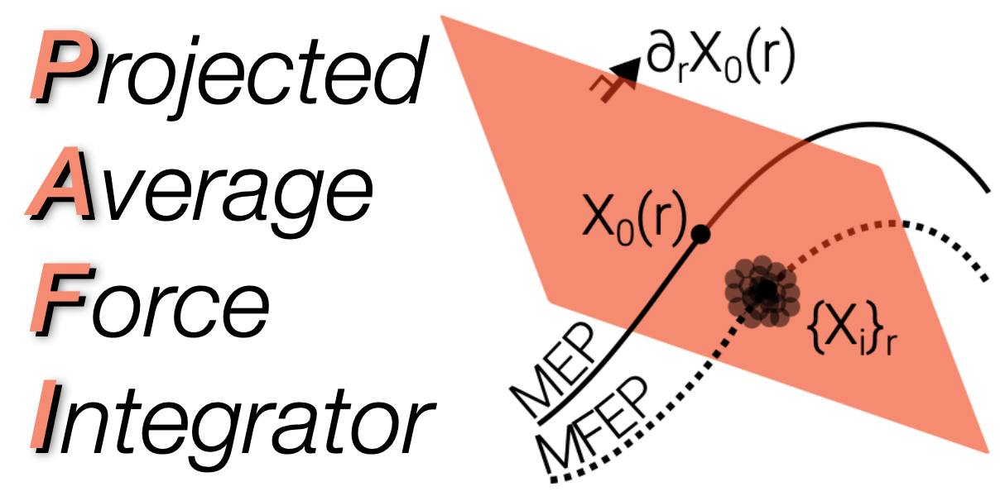

</img>
<h2> pafi: Free energy barriers beyond Harmonic TST with ASE calculators</h2>
<h4 align="center">Swinburne and Marinica, Phys. Rev. Lett 2018 (<a href="#citation">bibtex citation</a>).</h4>

PAFI performs constrained sampling on NEB hyperplanes using any <a href="https://wiki.fysik.dtu.dk/ase/ase/calculators/calculators.html" target="_new">ASE calculator</a>,
analytically reformulating an exact expression for the free energy gradient used in the
<a href="https://pubs.acs.org/doi/10.1021/jp506633n" target="_new">Adaptive Biasing Force</a> method.
This allows calculation of free energy barriers even when the minimum energy path (MEP)
is not aligned with the minimum free energy path (MFEP). PAFI thus performs
<a href="https://en.wikipedia.org/wiki/Stratified_sampling" target="_new">stratified sampling</a> of configuration space for a particular metastable pathway, with the usual reductions in variance.

<h3 align="center">
<a href="#installation">Installation</a>
| <a href="#serial-usage">Serial Usage</a>
| <a href="#mpi-parallelism">MPI Parallelism</a>
| <a href="#offline-analysis">Offline Analysis</a>
| <a href="#hints-and-tips">Hints and tips</a>
| <a href="#claude-code-skill-pafi-setup">Claude Code skill</a>
| <a href="#citation">Citation</a>
| <a href="#use-cases-of-pafi">Use cases of PAFI</a>
</h3>
</br>

## Installation
pafi requires `numpy scipy matplotlib ase`. For MPI parallelism: `mpi4py`.
```bash
pip install -e .
```

## Serial Usage

See `eam-test.ipynb` for an interactive demonstration. Given a NEB pathway and any ASE calculator:

```python
from pafi import PAFI
from ase.io import read

images = read("neb_paths/w-vac-path.traj", index=":")
calc = ...  # any ASE calculator

pafi = PAFI(images, calc)
for r in np.linspace(0.0, 1.0, 11):
    pafi.run(r, T=300.0, nsteps=1000, thermsteps=500)
pafi.plot_data()
```


## MPI Parallelism

`PAFIMPI` distributes independent PAFI sampling across MPI workers. Each worker
runs its own Langevin trajectory; results are gathered to rank 0 for analysis.

Two communicators control the parallelism:

- **`worker_comm`** — ranks within a single worker. Passed to the Langevin integrator. Defaults to `MPI.COMM_SELF` (1 process per worker).
- **`inter_comm`** — communicates across workers for gather/scatter. Defaults to `MPI.COMM_WORLD`.

**The calculator must be constructed with the same communicator as `worker_comm`**. There is no generic ASE interface for this, so it is the caller's responsibility.

See `mpi-ase-test.py` for a complete working example.

### 1 process per worker (default)

The simplest case — each MPI rank is an independent worker:

```python
from mpi4py import MPI
from pafi import PAFIMPI

worker_comm = MPI.COMM_SELF
inter_comm = MPI.COMM_WORLD

calc = MyCalculator(..., comm=worker_comm)
pafi = PAFIMPI(images, calc, worker_comm=worker_comm, inter_comm=inter_comm)
```
```bash
mpirun -np 8 python script.py   # 8 independent workers
```

### Multi-process workers

For calculators that use MPI internally (e.g. 4 CPU cores per LAMMPS instance, or 2 GPUs per worker):

```python
world = MPI.COMM_WORLD
rank = world.Get_rank()
cpus_per_worker = 4
worker_id = rank // cpus_per_worker
is_root = (rank % cpus_per_worker == 0)

worker_comm = world.Split(color=worker_id, key=rank)
inter_comm = world.Split(color=0 if is_root else MPI.UNDEFINED, key=worker_id)

calc = MyParallelCalculator(..., comm=worker_comm)
pafi = PAFIMPI(images, calc, worker_comm=worker_comm, inter_comm=inter_comm)
```
```bash
mpirun -np 16 python script.py   # 4 workers x 4 cores each
```

### Data accumulation and restarts

Data accumulates across `run()` calls. Restarting from a previous JSON is safe with no duplication:

```python
if os.path.exists("results.json"):
    pafi.read_json("results.json")

for r in r_values:
    pafi.run(r, T=300.0, nsteps=1000, thermsteps=500)
    pafi.write_json("results.json")  # writes on rank 0 only
```

Use `pafi.reset_data()` to clear all accumulated data.

### Distributed r-values

Instead of all workers sampling the same `(r, T)`, distribute r-values across workers:

```python
pafi.run_distributed(np.linspace(0.0, 1.0, 21), T=300.0, nsteps=1000)
```

## Offline Analysis

`PAFIData` loads and plots results without a calculator or MPI:

```python
from pafi import PAFIData

data = PAFIData()
data.read_json("results.json")
data.plot_data(filename="free_energy.png")
```


## Hints and Tips

- The NEB pathway can be any ASE trajectory file or list of `Atoms` objects

- **The supercell can change along the pathway but all configurations should have the same type of supercell (orthogonal or triclinic)**

- In general, we want a reference pathway with dense discretisation where energy gradients are large

- If `nsteps` is too large, workers will make thermally activated "jumps" to nearby paths in the hyperplane. This will increase error. If this happens, decrease `nsteps` and run more times

- The total number of force calls per worker is `nPlanes * (thermsteps + nsteps)`, spatially parallelised across `worker_comm` for each worker

- Each PAFI worker runs at the same speed as a single calculator evaluation. Increasing `worker_comm` size (more cores per worker) will typically decrease execution time but also reduce the number of workers and increase error, as we have fewer independent samples

- If you are core-limited, run the script multiple times and reload with `read_json` — samples accumulate without duplication


## Claude Code skill: `pafi-setup`

This repo ships a [Claude Code](https://claude.com/claude-code) skill at
[`.claude/skills/pafi-setup/SKILL.md`](./.claude/skills/pafi-setup/SKILL.md)
that scaffolds a PAFI job from a user-provided folder. Given three
ingredients, it writes a ready-to-launch driver (and, if applicable, a
filled-in cluster submission script).

**Install the skill so Claude Code sees it anywhere:**

```bash
mkdir -p ~/.claude/skills/pafi-setup
cp .claude/skills/pafi-setup/SKILL.md ~/.claude/skills/pafi-setup/
# or symlink to track updates:
# ln -s "$PWD/.claude/skills/pafi-setup/SKILL.md" ~/.claude/skills/pafi-setup/SKILL.md
```

Without the copy, Claude only sees the skill when launched inside this
repo. A worked example of the skill's inputs and generated outputs lives
in [`claude-skill-example/`](./claude-skill-example).

**Inputs the skill expects in the folder:**

1. **A calculator-loading Python file** — exposes a factory such as
   `make_calculator(comm=None)` (or a module-level `calc = ...`) that
   returns an ASE `Calculator`. The skill imports from this file; it does
   not rewrite calculator construction.
2. **A list of ASE systems** — the NEB pathway, as any of:
   - an ASE-readable trajectory (`*.traj`, `*.xyz`, `*.extxyz`, `POSCAR*`,
     `*.cif`) loaded with `ase.io.read(path, index=":")`,
   - a directory of numbered images (`image_00.xyz`, …),
   - a Python script that constructs `images`.
3. **(Optional) a submission-script template** — SLURM / PBS / LSF / shell.
   The skill fills in placeholders and the `mpirun` / `srun` launch line
   while preserving the user's `#SBATCH` directives, `module load`,
   `conda activate`, account / partition / walltime, etc.

**Outputs written into the user's folder:**

- `run_pafi.py` — PAFI driver (serial `PAFI` or MPI `PAFIMPI`), with
  `read_json` / `write_json` restart wired up and rank-0-only I/O.
- `submit_pafi.sh` (or the template's extension) — the filled-in submission
  script, if a template was supplied.
- A printed launch command: `sbatch submit_pafi.sh`, `qsub …`,
  `mpirun -n <N> python run_pafi.py`, or `python run_pafi.py`.

**Example invocation (inside Claude Code):**

```
set up a PAFI run in ./my-w-vac/ — calculator is in calc.py,
NEB path is neb.traj, and use submit.slurm as the template
```

The skill will inventory the folder, confirm the calculator / NEB / grid
plan, then generate the files. It will **not** submit the job — that's
always left to the user.

Anti-patterns the skill explicitly avoids: guessing the calculator or
potential file, fabricating a submission template from scratch, inlining
calculator construction into the driver, and mocking the calculator for a
"dry run".

## Citation
For more details please see

Swinburne and Marinica, *Unsupervised Calculation of Free Energy Barriers in Large Crystalline Systems*, Phys. Rev. Lett., 2018 [link](https://link.aps.org/doi/10.1103/PhysRevLett.120.135503)

```bibtex
@article{PhysRevLett.120.135503,
  title = {Unsupervised Calculation of Free Energy Barriers in Large Crystalline Systems},
  author = {Swinburne, Thomas D. and Marinica, Mihai-Cosmin},
  journal = {Phys. Rev. Lett.},
  volume = {120},
  issue = {13},
  pages = {135503},
  numpages = {6},
  year = {2018},
  month = {Mar},
  publisher = {American Physical Society},
  doi = {10.1103/PhysRevLett.120.135503},
  url = {https://link.aps.org/doi/10.1103/PhysRevLett.120.135503}
}
```

## Use cases of PAFI

- Allera et al., *Activation entropy of dislocation glide*, Nature Communications, 2025 [link](https://arxiv.org/abs/2410.04813)
- Nahavandian et al., *From anti-Arrhenius to Arrhenius behavior in a dislocation-obstacle bypass: Atomistic Simulations and Theoretical Investigation*, Computational Materials Science, 2024 [link](https://doi.org/10.1016/j.commatsci.2023.112954)
- Namakian et al., *Temperature dependence of generalized stacking fault free energy profiles and dissociation mechanisms of slip systems in Mg*, Computational Materials Science, 2024 [link](https://doi.org/10.1016/j.commatsci.2023.112569)
- Namakian et al., *Temperature dependent stacking fault free energy profiles and partial dislocation separation in FCC Cu*, Computational Materials Science, 2023 [link](https://doi.org/10.1016/j.commatsci.2023.111971)
- Baima et al., *Capabilities and limits of autoencoders for extracting collective variables in atomistic materials science*, Physical Chemistry Chemical Physics, 2022 [link](https://doi.org/10.1039/D2CP02765K)
- Sato et al., *Anharmonic effect on the thermally activated migration of {101̄2} twin interfaces in magnesium*, Materials Research Letters, 2021 [link](https://doi.org/10.1080/21663831.2021.1873300)
